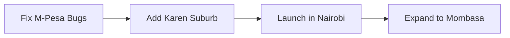

# MtaaTrust 🇰🇪

> **"Don't just find a handyman. Find a trusted neighbor."**

MtaaTrust is Kenya's first community-vetted local services platform. We connect homeowners with verified pros (plumbers, electricians, etc.) using a trust system built on real relationships, not just paid reviews.

[](https://youtu.be/your-demo)
[](https://test.mtaatrust.co.ke)

## Project Progress
**Nairobi Coverage:** 
**M-Pesa Integration:** 
**Swahili Translation:** 

##  Next Milestone: 1000 Jobs!
We're at **824/1000** jobs completed


##  Quick Test Drive

1. **Try our API:**
```bash
curl -X GET "https://api.mtaatrust.co.ke/providers?location=karen"
```

2. **See a provider profile:**
 [View Juma's Profile](https://demo.mtaatrust.co.ke/providers/juma-electrician)

##  Leaderboard (Top Contributors)
| Contributor | Badges | Specialties |
|------------|--------|-------------|
| @Floyce |  Founder | Everything |
| @kenyanDev |  M-Pesa Expert | Payments |
| @estateLady |  Community | Vouches |

##  Current Focus


##  Community Wall
"Just helped fix a leak in my neighbor's house through MtaaTrust!" - @user456
"My trust score went from 45 to 89 in 3 months!" - @provider007

##  Learn More
- [ Roadmap](ROADMAP.md) - See where we're going
- [ Challenges](CHALLENGES.md) - Win bounties and badges
- [ Real Stories](STORIES.md) - Impact in our community
- [ Badges](BADGES.md) - Gamification system

## 🇰🇪 For Our Kenyan Developers

### Common Issues & Solutions:
```
### "M-Pesa timed out"
Solution: Check our `mpesa_retry_pattern.py` - includes Kenyan peak hour logic!

### "User says 'Niko na shida'"
Solution: Our AI detects emergency keywords and prioritizes these jobs!
```

## Contributing
See [CONTRIBUTING.md](CONTRIBUTING.md) for details on how to join the mission.

## License
MIT
